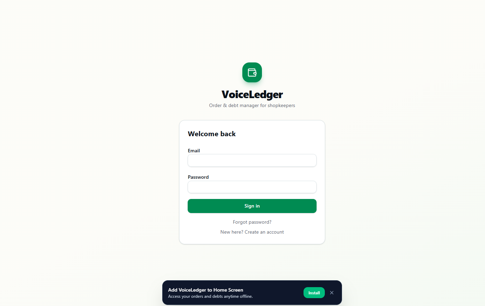
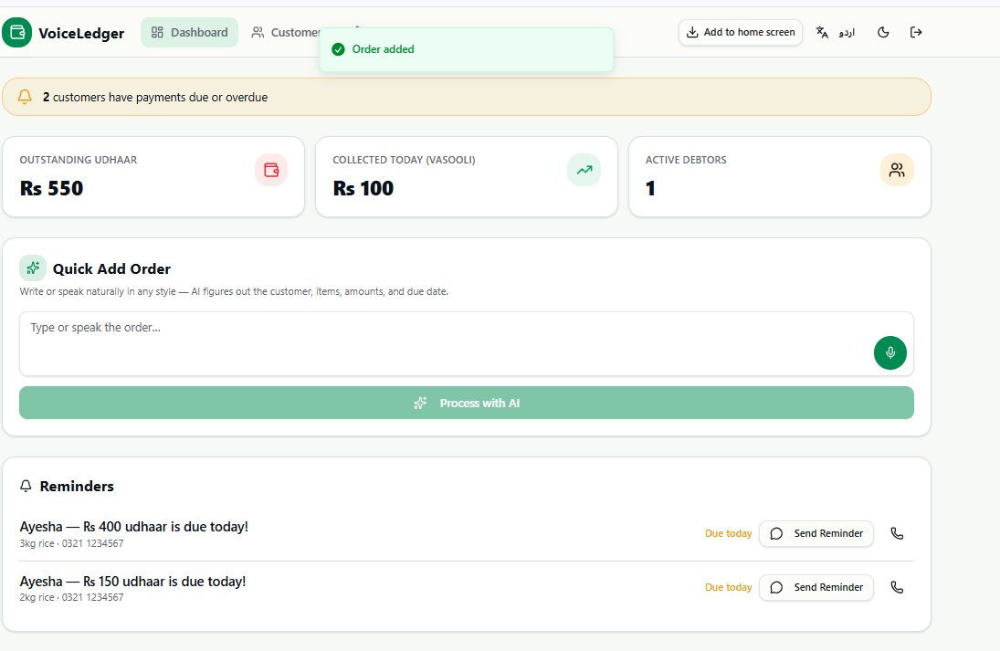

<div align="center">


# VoiceLedger

### Order & Debt Manager for Shopkeepers — Powered by AI, Built for the Khaata

VoiceLedger digitizes the traditional *khaata* (credit ledger) that local shopkeepers have kept on paper for generations — replacing it with a fast, AI-assisted, offline-capable web app that works in the shopkeeper's own language.

[](https://vercel.com)
[](https://firebase.google.com)
[](#)
[](#)

</div>

---

## 📖 About the Project

Millions of small shopkeepers across Pakistan and South Asia extend informal credit (*udhaar*) to regular customers and track it by hand in a notebook. This system is slow, error-prone, hard to search, and easy to lose. **VoiceLedger** solves this by letting a shopkeeper simply **speak or type an order in natural language** — in Urdu or English — and have AI instantly extract the customer, items, amounts, and due date into a structured, digital ledger entry.

No manual forms. No complicated data entry. Just talk, review, sign, and save.

---

## ✨ Key Features

### 🔐 Authentication & Access
- Secure sign-in / sign-up flow — existing users sign in directly; new users are prompted to create an account before proceeding.
- **Installable Progressive Web App (PWA)** — shopkeepers can add VoiceLedger to their phone's home screen and use it like a native app, even fully **offline**.
- Offline-first design: data entered without an internet connection is synced automatically to Firebase the moment the device reconnects.

<p align="center">
  
</p>

### 📊 Dashboard
- At-a-glance business snapshot:
  - **Outstanding Udhaar** — total pending credit
  - **Collected Today (Vasooli)** — payments received today
  - **Active Debtors** — number of customers with an open balance
- Live **due/overdue payment alerts** banner.
- **Reminders panel** listing customers with upcoming or overdue dues, each with one-tap **WhatsApp reminder** and **call** buttons.

<p align="center">
  
</p>

### 🎙️ AI-Powered Quick Add Order
The core feature of VoiceLedger. A shopkeeper can **type or speak** an order exactly as they'd say it out loud — e.g. *"Ayesha ne 3kg chawal liye, 400 total, kuch nahi diya, agle hafte tak"* — and hit **Process with AI**.

- The input is sent as a structured prompt to **Google Gemini**, which parses out:
  - Customer name & phone number
  - Items purchased
  - Total amount & amount paid
  - Due date
- Results populate an editable **Review Order** popup, so the shopkeeper can double-check and correct anything the AI got wrong before saving.
- A **signature pad** lets the customer confirm the order digitally, right on the same screen.
- The outstanding **balance** is calculated automatically.

<p align="center">
  
  &nbsp;&nbsp;
  
</p>

### 👥 Customers (Khaata / Ledger)
- Searchable list of all customers with their live outstanding balance.
- **Export Ledger (CSV)** — download the complete ledger (customer, phone, transaction type, date, items, total, paid, balance, due date, signed status) for offline record-keeping or accounting.
- Tapping a customer opens their **full history**:
  - All past orders and payments with signatures
  - **Log Payment** field to record new payments against the balance instantly
  - **Generate Receipt** — creates a downloadable receipt
  - **Show QR** — customer can scan a QR code to get their own copy of the receipt
  - Quick-access **WhatsApp**, **Send Reminder**, and **Call** buttons

<p align="center">
  
</p>
<p align="center">
  
  &nbsp;&nbsp;
  
</p>

### ⚙️ Settings
- Update shop name and email address
- Change password
- Delete account
- Sign out
- Generate business reports

### 🌐 Accessibility & Personalization
- **Bilingual interface** — instantly switch between **English and Urdu** (with full RTL support) via the language toggle.
- **Dark / light mode** toggle for comfortable use at any time of day.

---

## 🛠️ Tech Stack

| Layer | Technology |
|---|---|
| **Frontend** | Web app (PWA-enabled, installable, offline-capable) |
| **AI Parsing** | Google Gemini (natural language → structured order data) |
| **Database** | Firebase (real-time database / Firestore) with live sync |
| **Offline Support** | PWA local storage/cache, synced to Firebase on reconnect |
| **Hosting/CI-CD** | Vercel, deployed directly from GitHub |
| **Voice Input** | Browser speech-to-text for hands-free order entry |
| **Messaging** | WhatsApp deep-linking for reminders and receipts |

---

## 🏗️ How It Works — Architecture Flow

```
Shopkeeper speaks/types order
          │
          ▼
  Quick Add Order (Dashboard)
          │
          ▼
  "Process with AI" → Google Gemini API
          │  (extracts customer, items, total, paid, due date)
          ▼
   Review Order popup (editable + signature capture)
          │
          ▼
   Save → Firebase Realtime Database
          │
          ▼
  Dashboard stats, Reminders & Customer Ledger
  update instantly across all connected devices
```

If the shopkeeper is offline when an order is added, it is cached locally by the PWA and automatically pushed to Firebase as soon as connectivity returns — no data is lost.

---

## 🚀 Getting Started

### Prerequisites
- Node.js (LTS recommended)
- A Firebase project (Firestore + Authentication enabled)
- A Google Gemini API key
- A Vercel account (for deployment)

### Installation

```bash
# Clone the repository
git clone https://github.com/<your-username>/voiceledger.git
cd voiceledger

# Install dependencies
npm install

# Set up environment variables
cp .env.example .env.local
```

Add your credentials to `.env.local`:

```env
NEXT_PUBLIC_FIREBASE_API_KEY=
NEXT_PUBLIC_FIREBASE_AUTH_DOMAIN=
NEXT_PUBLIC_FIREBASE_PROJECT_ID=
NEXT_PUBLIC_FIREBASE_STORAGE_BUCKET=
NEXT_PUBLIC_FIREBASE_MESSAGING_SENDER_ID=
NEXT_PUBLIC_FIREBASE_APP_ID=
GEMINI_API_KEY=
```

### Run locally

```bash
npm run dev
```

### Deploy

The app auto-deploys to **Vercel** on every push to the `main` branch via GitHub integration.

---

## 📱 Using VoiceLedger

1. **Sign up / Sign in** and optionally install the app to your home screen for offline access.
2. On the **Dashboard**, type or speak a new order in the Quick Add Order box.
3. Tap **Process with AI** and review the auto-filled order details.
4. Have the customer **sign** on screen, then hit **Save**.
5. Track dues from the **Reminders** panel and follow up via WhatsApp or a direct call.
6. Visit **Customers** to view any customer's full history, log a payment, generate a receipt, or export the entire ledger as a CSV.
7. Manage your shop profile and account from **Settings**.

---

## 🗺️ Roadmap Ideas
- [ ] Multi-shop / multi-user support
- [ ] Automated recurring reminder scheduling
- [ ] Analytics dashboard (monthly udhaar trends, top debtors)
- [ ] Additional regional language support

---

## 🤝 Contributing
Contributions, issues, and feature requests are welcome. Feel free to check the [issues page](../../issues) or open a pull request.

## 📄 License
This project is licensed under the MIT License — see the `LICENSE` file for details.

---

<div align="center">
Made for shopkeepers who deserve modern tools without giving up their traditional way of doing business. 🏪
</div>


