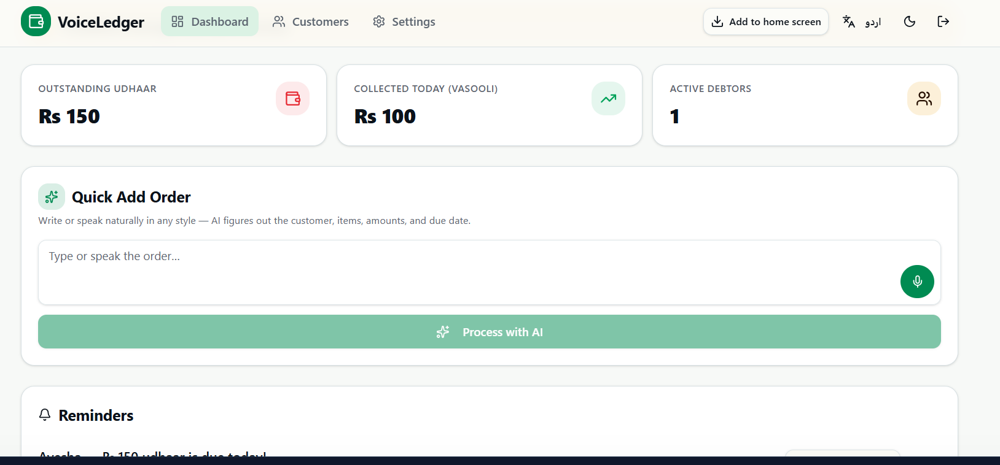
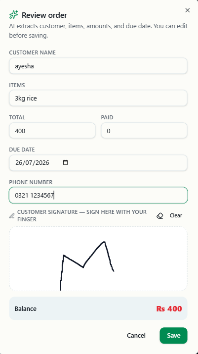
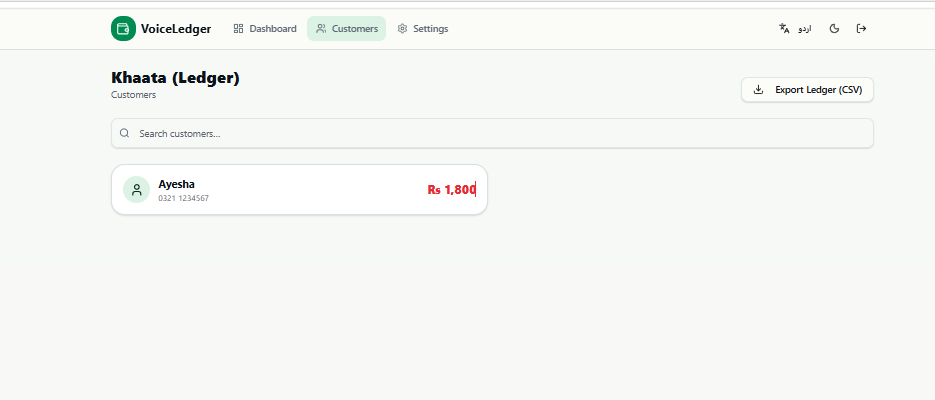
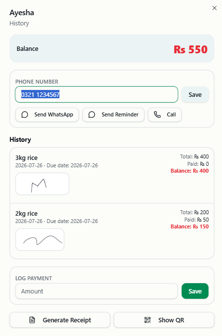
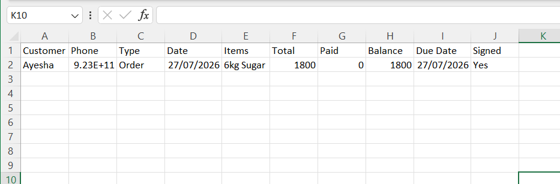

<div align="center">

# VoiceLedger
 
### 🔗 Live Demo
[voice-ledger-eight.vercel.app](https://voice-ledger-eight.vercel.app/)
 
### Order & Debt Manager for Shopkeepers — Powered by AI, Built for the Khaata
 
VoiceLedger digitizes the traditional *khaata* (credit ledger) that local shopkeepers have kept on paper for generations — replacing it with a fast, AI-assisted, offline-capable web app that works in the shopkeeper's own language.
 
[](https://vercel.com)
[](https://firebase.google.com)
[](#)
[](#)
 
</div>
---
 
## 📖 About the Project
 
Millions of small shopkeepers across Pakistan and South Asia extend informal credit (*udhaar*) to regular customers and track it by hand in a notebook. This system is slow, error-prone, hard to search, and easy to lose. **VoiceLedger** solves this by letting a shopkeeper simply **speak or type an order in natural language** — in Urdu or English — and have AI instantly extract the customer, items, amounts, and due date into a structured, digital ledger entry.
 
**Who it's for:** small shopkeepers, kiryana store owners, and local vendors who currently track customer credit (*udhaar*) on paper and need a faster, more reliable, mobile-friendly way to manage it — without giving up how they naturally speak about a sale.
 
No manual forms. No complicated data entry. Just talk, review, sign, and save.
 
---
 
## ✨ Key Features
 
### 🔐 Authentication & Access
- Secure sign-in / sign-up flow — existing users sign in directly; new users are prompted to create an account before proceeding.
- **Installable Progressive Web App (PWA)** — shopkeepers can add VoiceLedger to their phone's home screen and use it like a native app, even fully **offline**.
- Offline-first design: data entered without an internet connection is synced automatically to Firebase the moment the device reconnects.
<p align="center">
  
</p>
### 📊 Dashboard
- At-a-glance business snapshot:
  - **Outstanding Udhaar** — total pending credit
  - **Collected Today (Vasooli)** — payments received today
  - **Active Debtors** — number of customers with an open balance
- Live **due/overdue payment alerts** banner.
- **Reminders panel** listing customers with upcoming or overdue dues, each with one-tap **WhatsApp reminder** and **call** buttons.
<p align="center">
  
</p>
### 🎙️ AI-Powered Quick Add Order
The core feature of VoiceLedger. A shopkeeper can **type or speak** an order exactly as they'd say it out loud — e.g. *"Ayesha ne 3kg chawal liye, 400 total, kuch nahi diya, agle hafte tak"* — and hit **Process with AI**.
 
- The input is sent as a structured prompt to **Google Gemini**, which parses out:
  - Customer name & phone number
  - Items purchased
  - Total amount & amount paid
  - Due date
- Results populate an editable **Review Order** popup, so the shopkeeper can double-check and correct anything the AI got wrong before saving.
- A **signature pad** lets the customer confirm the order digitally, right on the same screen.
- The outstanding **balance** is calculated automatically.
**Model:** Google AI Studio — `gemini-1.5-flash`
**Output Mode:** Strict JSON (`application/json`)
 
<details>
<summary><strong>🧠 View the system prompt sent to Gemini</strong></summary>
```text
You extract structured order info for a shopkeeper's ledger from free-form text in English, Urdu, Hindi, or Roman Urdu. The user may write in ANY style. Extract:
- customer_name (string): buyer's name. If missing, use "Customer".
- items (string): concise description of items with quantities, e.g. "3kg flour, 2 eggs".
- total_amount (number): total price in PKR. 0 if unknown.
- amount_paid (number): amount already paid. 0 if none/unknown.
- remaining_balance (number): total_amount - amount_paid (never negative). Prefer explicit balance if stated.
- due_date (string): ISO date YYYY-MM-DD if a due date is expressed (today, tomorrow, kal, Friday, "in 3 days", or explicit date). Empty string if none.
```
 
</details>
The parsed JSON pre-fills the Review Order form — the shopkeeper always reviews and can correct any field before saving, so AI mistakes never get saved silently.
 
<p align="center">
  
  &nbsp;&nbsp;
  
</p>
### 👥 Customers (Khaata / Ledger)
- Searchable list of all customers with their live outstanding balance.
- **Export Ledger (CSV)** — download the complete ledger (customer, phone, transaction type, date, items, total, paid, balance, due date, signed status) for offline record-keeping or accounting.
- Tapping a customer opens their **full history**:
  - All past orders and payments with signatures
  - **Log Payment** field to record new payments against the balance instantly
  - **Generate Receipt** — creates a downloadable receipt
  - **Show QR** — customer can scan a QR code to get their own copy of the receipt
  - Quick-access **WhatsApp**, **Send Reminder**, and **Call** buttons
<p align="center">
  
</p>
<p align="center">
  
  &nbsp;&nbsp;
  
</p>
### ⚙️ Settings
- Update shop name and email address
- Change password
- Delete account
- Sign out
- Generate business reports
### 🌐 Accessibility & Personalization
- **Bilingual interface** — instantly switch between **English and Urdu** (with full RTL support) via the language toggle.
- **Dark / light mode** toggle for comfortable use at any time of day.
---
 
## 🛠️ Tech Stack
 
| Layer | Technology |
|---|---|
| **Frontend Framework** | React 19 + TypeScript |
| **Routing** | TanStack Start (`@tanstack/react-start`, `@tanstack/react-router`) |
| **Build Tool** | Vite |
| **Styling / UI** | Tailwind CSS + Radix UI (shadcn-style components) |
| **Forms & Validation** | React Hook Form + Zod |
| **App Builder** | [Lovable](https://lovable.dev) (AI-assisted development, synced with GitHub) |
| **AI Parsing** | Google Gemini `gemini-1.5-flash` (strict JSON output — natural language → structured order data) |
| **Database** | Firebase (real-time database / Firestore) with live sync |
| **PWA / Offline Support** | `vite-plugin-pwa` — installable app with local caching, synced to Firebase on reconnect |
| **QR & Receipts** | `qrcode` for generating scannable receipt QR codes |
| **Notifications** | Sonner (in-app toasts, e.g. "Order added") |
| **Hosting/CI-CD** | Vercel, deployed directly from GitHub |
| **Voice Input** | Browser speech-to-text for hands-free order entry |
| **Messaging** | WhatsApp deep-linking for reminders and receipts |
 
---
 
## 🏗️ How It Works — Architecture Flow
 
```
Shopkeeper speaks/types order
          │
          ▼
  Quick Add Order (Dashboard)
          │
          ▼
  "Process with AI" → Google Gemini API
          │  (extracts customer, items, total, paid, due date)
          ▼
   Review Order popup (editable + signature capture)
          │
          ▼
   Save → Firebase Realtime Database
          │
          ▼
  Dashboard stats, Reminders & Customer Ledger
  update instantly across all connected devices
```
 
If the shopkeeper is offline when an order is added, it is cached locally by the PWA and automatically pushed to Firebase as soon as connectivity returns — no data is lost.
 
---
 
## 🚀 How to Run the Project
 
### Prerequisites
- Node.js and npm — [install with nvm](https://github.com/nvm-sh/nvm#installing-and-updating)
- A Firebase project (Firestore + Authentication enabled)
- A Google Gemini API key
### Setup
 
```sh
# Clone the repository
git clone <this-repository-url>
cd <repository-name>
 
# Install dependencies
npm i
 
# Run the development server
npm run dev
```
 
### Environment variables
 
Create a `.env.local` file in the project root with your own credentials:
 
```env
VITE_FIREBASE_API_KEY=
VITE_FIREBASE_AUTH_DOMAIN=
VITE_FIREBASE_PROJECT_ID=
VITE_FIREBASE_STORAGE_BUCKET=
VITE_FIREBASE_MESSAGING_SENDER_ID=
VITE_FIREBASE_APP_ID=
GEMINI_API_KEY=
```
 
> ⚠️ Adjust variable names/prefixes to match however your build tool (TanStack Start) exposes env vars — replace the placeholder names above with your actual keys.
 
### Deployment
The app is deployed on **Vercel**, connected directly to this GitHub repository — every push to the main branch triggers an automatic redeploy.
 
This project was built with **[Lovable](https://lovable.dev)** — changes made in the Lovable editor sync automatically to this repository, and changes pushed to the repository sync back into Lovable.
 
---
 
## 📱 Using VoiceLedger
 
1. **Sign up / Sign in** and optionally install the app to your home screen for offline access.
2. On the **Dashboard**, type or speak a new order in the Quick Add Order box.
3. Tap **Process with AI** and review the auto-filled order details.
4. Have the customer **sign** on screen, then hit **Save**.
5. Track dues from the **Reminders** panel and follow up via WhatsApp or a direct call.
6. Visit **Customers** to view any customer's full history, log a payment, generate a receipt, or export the entire ledger as a CSV.
7. Manage your shop profile and account from **Settings**.
---
 
## 🗺️ Roadmap Ideas
- [ ] Multi-shop / multi-user support
- [ ] Automated recurring reminder scheduling
- [ ] Analytics dashboard (monthly udhaar trends, top debtors)
- [ ] Additional regional language support
---
 
## 🤝 Contributing
Contributions, issues, and feature requests are welcome. Feel free to check the [issues page](../../issues) or open a pull request.
 
## 📄 License
This project is licensed under the MIT License — see the `LICENSE` file for details.
 
---
 
<div align="center">
Made for shopkeepers who deserve modern tools without giving up their traditional way of doing business. 🏪
</div>
 


